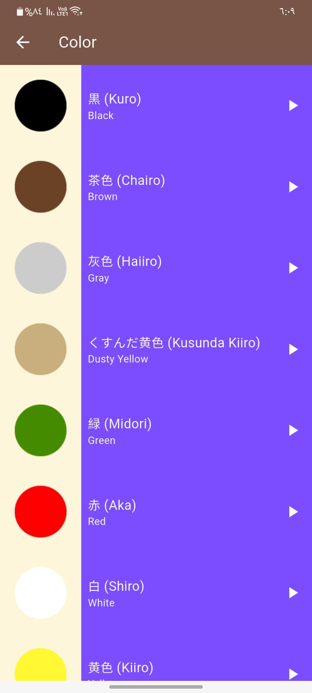
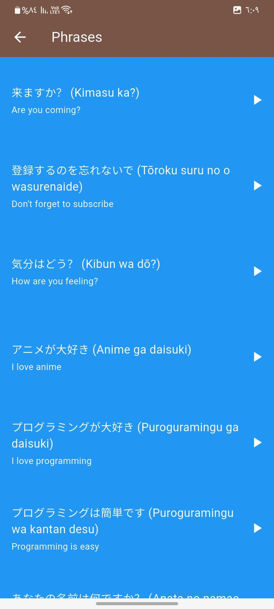

# Toku

**Toku** is an educational Flutter app designed to help users learn basic Japanese through categorized vocabulary and audio pronunciation. It provides Japanese words and phrases with both English and Japanese translations, along with native pronunciation audio.

## ✨ Features

- 🎧 Native Japanese audio pronunciation
- 🇯🇵 Words and phrases in both Japanese and English
- 📚 Organized categories: Numbers, Family Members, Colors, and Phrases
- 🔙 Smooth navigation with back functionality
- 📱 Clean and user-friendly UI

## 📂 Categories

- **Numbers** — Learn to count in Japanese
- **Family Members** — Common terms for relatives
- **Colors** — Basic color vocabulary
- **Phrases** — Everyday useful expressions

## 🛠 Built With

- **Flutter**
- **audioplayers** package

## 🚀 Getting Started

Make sure Flutter is installed, then run:

```bash
flutter pub get
flutter run
```

## 📷 Screenshots

*(




)*

## 📄 License

This project is open source and free to use for personal or educational purposes.
